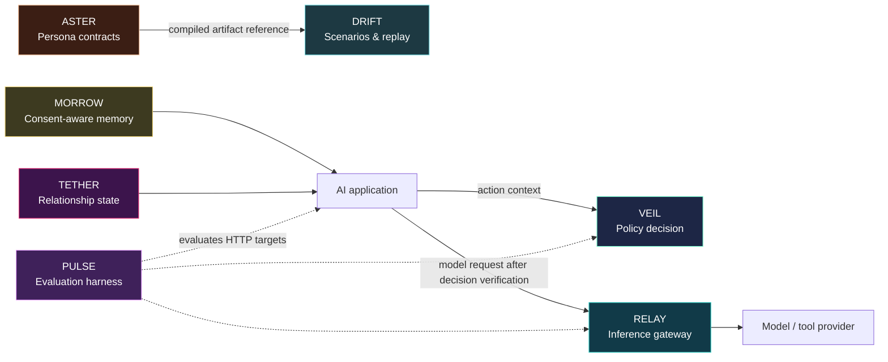

# MORROW
<p align="center">
  
</p>

<p align="center"><strong>Part of the Tuzuminami AI Systems reference architecture.</strong><br />Independent packages, designed to compose — without claiming runtime package dependencies.</p>

> **System role:** Remember only with consent. MORROW keeps memory bounded by purpose, policy, consent, retention, and tenant scope.

## Ecosystem reference architecture

The map below describes an **intended composition**, not current npm/package dependencies. Every repository remains independently usable and independently versioned. An application verifies a VEIL decision before it invokes RELAY; this does not indicate direct VEIL-to-RELAY SDK integration.



| System | What it contributes |
| --- | --- |
| [VEIL](https://github.com/tuzuminami/veil) | Fail-closed policy decisions and receipts before agent actions. |
| [TETHER](https://github.com/tuzuminami/tether) | Explicit, explainable relationship state. |
| [RELAY](https://github.com/tuzuminami/relay) | Tenant-aware inference routing and provider enforcement. |
| [PULSE](https://github.com/tuzuminami/pulse) | Regression evaluation for HTTP targets and release evidence. |
| [MORROW](https://github.com/tuzuminami/morrow) | Consent, purpose, retention, and revocation-aware memory. |
| [DRIFT](https://github.com/tuzuminami/drift) | Deterministic scenario/session orchestration and replay. |
| [ASTER](https://github.com/tuzuminami/aster) | Versioned persona contracts compiled into portable artifacts. |


MORROW is an early-stage Consent-Aware Memory Engine for AI applications. It
stores, retrieves, revokes, expires, deletes, and exports typed memories only
when tenant, subject, purpose, policy, consent, and retention constraints permit
it.

The repository is built as a commercial-friendly OSS foundation: explicit
contracts, fail-closed behavior, tenant boundaries, append-only audit evidence,
and adapter-ready architecture come before UI or provider integrations.

## Status

This is a v0.2 OSS preview. It includes:

- typed memory registration for `episodic`, `fact`, `preference`,
  `relationship`, and `instruction`
- consent receipt registration and enforcement before persistence/retrieval
- retention rules and expiry filtering
- tenant, subject, type, purpose, and policy-scoped retrieval
- idempotent memory writes and revocations
- deletion-request and subject-export HTTP routes
- append-only audit events with actor, reason, and correlation ID
- dependency-free PostgreSQL transaction and memory-store ports that can be
  wired to `pg.Pool` without importing provider SDKs into the domain layer
- OpenAPI 3.1 draft, JSON Schema, PostgreSQL up/down migrations, Docker
  Compose, CI, and repository private-boundary guard

The current executable API uses an in-memory adapter for deterministic tests and
local demos. The PostgreSQL storage foundation is available as a port and
transaction provider; production wiring is intentionally kept outside the domain
core.

## Quick Start

```bash
pnpm install
pnpm run verify
pnpm run demo
```

`pnpm run demo` registers retention, consent, and one synthetic memory, then
queries it under the same tenant and purpose.

For the PostgreSQL schema preview:

```bash
docker compose up
```

The compose file initializes PostgreSQL with `migrations/001_initial.sql`.
Rollback SQL is kept in `migrations/001_initial.down.sql`, and
`pnpm run verify` checks that the migration pair preserves the tenant/type query
boundary and idempotency table contract.

## Public API Direction

The draft OpenAPI contract lives in `openapi/openapi.yaml` and currently covers:

- `POST /v1/consent-receipts`
- `POST /v1/retention-rules`
- `POST /v1/memories`
- `POST /v1/memories/query`
- `POST /v1/memories/{memoryId}/revoke`
- `POST /v1/deletion-requests`
- `GET /v1/subjects/{subjectId}/export`

The package exports the in-memory engine, domain types, typed errors, HTTP
dispatch utilities, and storage ports from `src/index.ts`.

MORROW does not implement Persona Contract compilation, relationship scoring,
scenario orchestration, LLM provider routing, policy PDP behavior, or an
evaluation harness. Persona-like and relationship-like facts can be stored as
typed memory data when the same consent, retention, tenant, and policy
constraints allow it.

To run the dependency-free API locally:

```bash
pnpm start
```

## Safety Properties

- Missing consent fails closed before memory persistence.
- Wrong-tenant retrieval and subject export return no cross-tenant data.
- Wrong-tenant mutation is denied.
- Expired retention removes memories from retrieval and export.
- Repeated idempotency keys do not duplicate side effects.
- Conflicting idempotency-key reuse fails closed.
- Revocation clears retrievable content and records audit evidence.
- Deletion requests revoke retrievable content and are idempotent.
- SQL storage queries include tenant, subject, type, purpose, policy, status,
  and TTL predicates at the database boundary.
- PostgreSQL migrations include a rollback file and an idempotency-key table
  scoped by tenant and actor.
- Private operator material and private requirement documents are blocked by
  `.gitignore`, `.dockerignore`, `.npmignore`, and `scripts/check-private-boundary.mjs`.

## Limitations

- Authentication is a development header adapter, not a production identity
  provider integration.
- The packaged runtime still defaults to in-memory storage. The PostgreSQL port
  is driver-compatible, but this release does not bundle the `pg` dependency.
- Vector search, plugin host runtime, workers, SDK, and CLI are planned
  follow-up slices.
- Strict TypeScript build is enabled, with JavaScript and declaration output
  emitted under `dist/`.

## License

Apache-2.0
